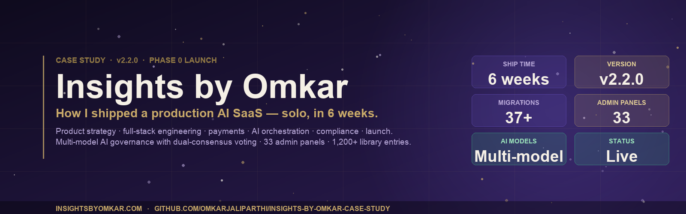
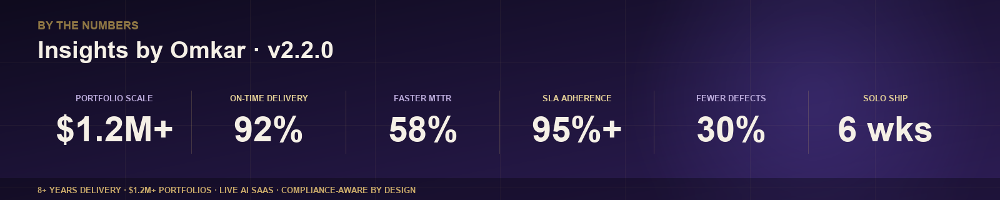

  

  
  
  
  

  <i>Public case study. Production code private. What's shared: architecture, decisions, operating playbooks — no proprietary code.</i>

---

## TL;DR

Built and launched **[insightsbyomkar.com](https://www.insightsbyomkar.com)** — a production AI SaaS — in **6 weeks, solo**, under **Omkar's Holistic Services LLC** (formed May 2023, DBA *Insights by Omkar*). End to end: product, UX, full-stack engineering, payments, AI, email, support, compliance, launch.

Most PM/TPM candidates own one layer. This project evidences all four — and the judgment to know which layer to invest in at each stage.

---

  

---

## At a glance *(current: v2.2.0 — Phase 0 launch)*

| | |
|---|---|
| **Product** | AI consumer SaaS · 13 indexed content traditions · 5 paid AI chambers (tarot, custom spell, dream journal, rune cast, numerology) |
| **Surface** | **1,200+ library entries** · 37 DB migrations · 33 admin panels · 100+ JSON-LD-enriched pages |
| **Timeline** | v0.01 → v2.2.0 · ~6 weeks core ship + post-launch hardening · 2026-03-05 → ongoing |
| **Releases** | 20+ versioned · full [CHANGELOG](https://github.com/omkarjaliparthi/insights-by-omkar) |
| **Stack** | Next.js 16 · React 19 · Supabase · TypeScript · Tailwind · Vercel |
| **Payments** | Stripe (credits + subs, dual webhook endpoints) + PayPal (credits, CAPTURE intent) · Lucky Pro + Lucky Max tiers, M/A billing · Customer Portal |
| **AI · content** | **Content Forge** (Chandra + Surya — blind dual review) → **Intelligence Triad** (Brahma + Vishnu + Shiva dual consensus) — every decision carries evidence, risk level 1-5, confidence 0-1.0 |
| **AI · product** | Shared chamber runner · atomic credit consumption via Postgres RPC row-lock + automatic refund on failure · cross-session memory synthesis |
| **Ops** | 5 Vercel crons · Resend (SPF/DKIM/DMARC) · in-house `error_log` + optional Sentry · `/admin/observability` severity stream · `/admin/payments` stuck-payment detector |
| **Compliance** | RLS on every user-scoped table · 4-category GDPR cookie banner · consent logging · chargeback defense · enforced refund policy · E-E-A-T signals (Person schema, bylines) |
| **SEO** | 15-group sitemap · thin-vertical quarantine (robots:noindex <20-entry) · bidirectional cross-link graph · JSON-LD (Organization, Person, WebSite, BreadcrumbList, Article, HowTo, Product, Service, FAQPage, CollectionPage, TechArticle) · GSC + Bing + IndexNow |

---

## 📑 Read the case study

1. **[Problem & users](./docs/01-problem-and-users.md)** — why it exists, who it serves
2. **[Architecture](./docs/02-architecture.md)** — system, data model, cron topology
3. **[Decision · payment rails](./docs/03-decision-payment-rails.md)** — Stripe + PayPal, with tradeoff matrix
4. **[Decision · tiered support agents](./docs/04-decision-support-agent-tiering.md)** — 6 rotating Tier-1 + auto-escalation
5. **[Decision · chargeback defense](./docs/05-decision-chargeback-defense.md)** — governance as product
6. **[Operating rhythm](./docs/06-operating-rhythm.md)** — releases, checklists, crons
7. **[Outcomes & lessons](./docs/07-outcomes-and-lessons.md)** — what worked, what to change
8. **[User flows](./docs/08-user-flows.md)** — signup, support escalation, refund/chargeback, content automation
9. **[Decision log](./docs/09-decision-log.md)** — 5 strategic plans surfaced from the program archive (batch rollout, performance audit, status audit, paid features, approval workflow)

---

## Skills this project evidences

<table>
<tr>
<th>Product</th>
<th>Program</th>
<th>Engineering</th>
<th>Business</th>
</tr>
<tr>
<td valign="top">

- 0 → 1 product discovery
- Structured-output AI UX
- Pricing & packaging
- Feature scoping & cut lists
- Release sequencing

</td>
<td valign="top">

- Versioned release discipline
- Pre-launch checklists
- Incident + RCA playbooks
- Cron/ops scheduling
- Observability setup

</td>
<td valign="top">

- Full-stack TS/Next.js
- Supabase + RLS design
- Payment webhook integration
- Multi-provider AI orchestration
- Production deployment

</td>
<td valign="top">

- Unit economics & pricing
- Chargeback defense (LLB + ICWA)
- Refund policy design
- Subscription modeling
- Legal/compliance sequencing

</td>
</tr>
</table>

---

## Who I am

**Omkar Jaliparthi** · Product & Program leader · 8+ years across PM, BA, and full-stack shipping.
Founder of **Omkar's Holistic Services LLC** (DBA *Insights by Omkar*) since May 2023.
MS CS · LLB · ICWA Intermediate · San Jose, CA · Open to Senior PM / TPM / Founding PM.

  <a href="https://github.com/omkarjaliparthi">GitHub</a> ·
  <a href="https://www.linkedin.com/in/jaliparthiomkar">LinkedIn</a> ·
  <a href="mailto:Jaliparthiomkar03@gmail.com">Email</a> ·
  <a href="https://www.insightsbyomkar.com">Live product</a>

