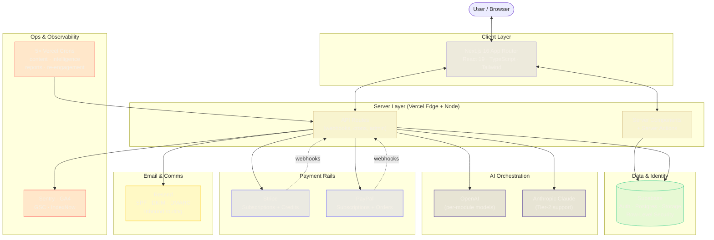
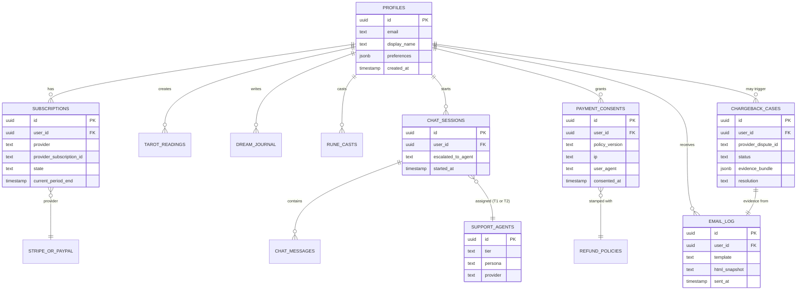

# 02 · Architecture

## System overview



---

## Data model (high-level)

30+ migrations shipped, all changes versioned. Key domains:

| Domain | Core tables | Purpose |
|---|---|---|
| **Identity** | `profiles`, `ghost_profiles`, `guest_ip_rate_limits` | Signed-in + guest user flows, abuse prevention |
| **Content modules** | `tarot_readings`, `spells`, `rune_casts`, `dream_journal`, `numerology_profiles` | Per-module reading artifacts |
| **Monetization** | `subscriptions`, `credit_packages`, `impulse_packages`, `refund_policies` | Subscription tiers, credit economy, refund windows |
| **Compliance** | `payment_consents`, `chargeback_cases`, `email_log` | Consent proof, dispute defense, comms audit |
| **Support** | `support_agent_settings`, `support_agents`, `chat_sessions`, `chat_messages`, `support_tickets` | Multi-tier AI agent system + human escalation |
| **Content ops** | `content_pipeline`, `intelligence_layers`, `approval_workflow`, `blog` | Scheduled content generation + publishing |
| **Governance** | Row-Level Security on every user-scoped table | Service role gated to server-side only |

**Every user-scoped table has RLS.** The service-role key never touches the client bundle.

### Data model — ER diagram (simplified)



---

## Cron topology

5 scheduled jobs run the content + ops engine:

| Schedule | Job | Purpose |
|---|---|---|
| Daily 06:00 UTC | `/api/cron/content-generate` | Generate next day's content (blog, rituals, daily card) |
| Daily 14:00 UTC | `/api/cron/content-publish` | Publish approved content, ping IndexNow, update sitemap |
| Weekly Mon 08:00 UTC | `/api/cron/intelligence` | Aggregate content intelligence, brainstorms, roadmap signals |
| Monthly 15th 10:00 UTC | `/api/cron/monthly-report` | Email monthly business report to admin |
| Daily 15:00 UTC | `/api/cron/re-engagement` | Re-engagement flows for dormant users |

Each is secured by a `CRON_SECRET` header check — Vercel Cron sends it, routes reject anything else. This pattern matters: **scheduled jobs are an attack surface if not signed**.

---

## AI provider strategy

Two providers wired in parallel — **OpenAI** and **Anthropic** — with per-module model env vars:

```
OPENAI_TAROT_MODEL
OPENAI_SPELL_MODEL
OPENAI_RUNE_MODEL
OPENAI_DREAM_MODEL
OPENAI_NUMEROLOGY_MODEL
ANTHROPIC_API_KEY            (Claude for support agents + escalation reasoning)
```

**Why both?** Three reasons:

1. **Redundancy.** If one provider has an outage or rate-limits, the product keeps working.
2. **Per-module model selection.** Claude is better for nuanced support; GPT-4 class is better for some structured outputs. Model swaps are env-var changes, not code changes.
3. **Cost control.** Swap to cheaper models on low-margin modules without a code deploy.

---

## Rendering & performance

- **App Router + RSC** — most pages are server-rendered; client hydration is scoped to interactive components
- **Turbopack** in dev
- **OG image auto-generation** per reading for shareable artifacts (every tarot reading has a unique Open Graph card)
- **Reduced-motion fallback** — 3D (`@react-three/*`, `gsap`) chambers gracefully degrade to static gradient backgrounds when OS reduced-motion is enabled

---

## What's *not* in the architecture

Decisions I explicitly didn't make yet, with reasoning in [07-outcomes-and-lessons.md](./07-outcomes-and-lessons.md):

- No microservices (monolith is right for this scale)
- No custom fine-tuned models (API-first)
- No native mobile (PWA-first)
- No event bus / queue (cron jobs + webhook handlers are sufficient for current volume)
