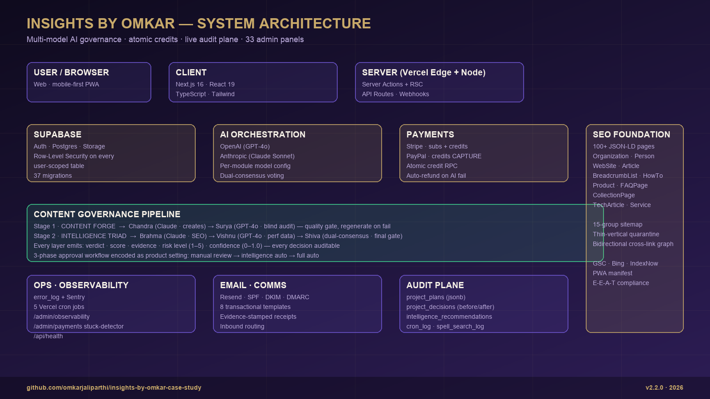
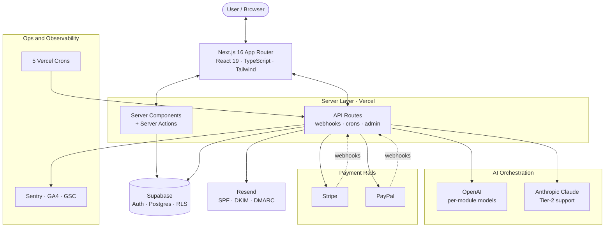
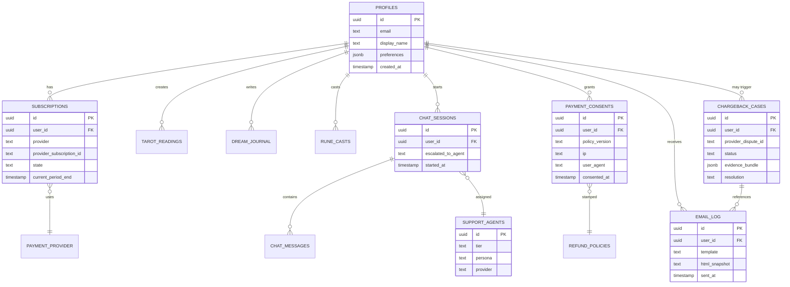
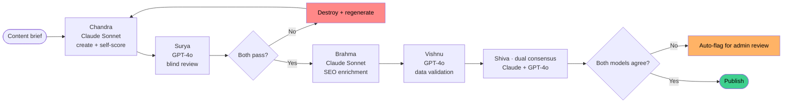

# 02 · Architecture

<p align="center">
  
</p>

## System overview



---

## Data model (high-level)

30+ migrations shipped, all changes versioned. Key domains:

| Domain | Core tables | Purpose |
|---|---|---|
| **Identity** | `profiles`, `ghost_profiles`, `guest_ip_rate_limits` | Signed-in + guest user flows, abuse prevention |
| **Content modules** | `tarot_readings`, `spells`, `rune_casts`, `dream_journal`, `numerology_profiles` | Per-module reading artifacts |
| **Monetization** | `subscriptions`, `credit_packages`, `impulse_packages`, `refund_policies` | Subscription tiers, credit economy, refund windows |
| **Compliance** | `payment_consents`, `chargeback_cases`, `email_log` | Consent proof, dispute defense, comms audit |
| **Support** | `support_agent_settings`, `support_agents`, `chat_sessions`, `chat_messages`, `support_tickets` | Multi-tier AI agent system + human escalation |
| **Content ops** | `content_pipeline`, `intelligence_layers`, `approval_workflow`, `blog` | Scheduled content generation + publishing |
| **Governance** | Row-Level Security on every user-scoped table | Service role gated to server-side only |

**Every user-scoped table has RLS.** The service-role key never touches the client bundle.

### Data model — ER diagram (simplified)



---

## Cron topology

5 scheduled jobs drive the content + ops engine:

| Schedule | Job | Purpose |
|---|---|---|
| Daily 06:00 UTC | `content-generate` | Generate next-day content (blog, rituals, daily card) |
| Daily 14:00 UTC | `content-publish` | Publish approved content, ping IndexNow, update sitemap |
| Mon 08:00 UTC | `intelligence` | Aggregate signals, brainstorms, roadmap |
| 15th 10:00 UTC | `monthly-report` | Email business report |
| Daily 15:00 UTC | `re-engagement` | Dormant-user flows |

Each signed with `CRON_SECRET`. Routes reject anything else. **Scheduled jobs are an attack surface if not signed.**

---

## AI provider strategy

Two providers in parallel — OpenAI + Anthropic — with per-module model env vars:

```
OPENAI_TAROT_MODEL
OPENAI_SPELL_MODEL
OPENAI_RUNE_MODEL
OPENAI_DREAM_MODEL
OPENAI_NUMEROLOGY_MODEL
ANTHROPIC_API_KEY   (Claude for support + escalation reasoning)
```

Why both:

1. **Redundancy** — one outage or rate-limit doesn't stop the product
2. **Per-module selection** — Claude is better for nuanced support, GPT-4 class for some structured outputs. Swaps are env changes, not code.
3. **Cost control** — cheaper models on low-margin modules, no deploy

---

## AI content pipeline · two-stage governance

Every piece of AI-generated content passes two sequential gates before publishing. Low-quality content never reaches the strategy layer; off-strategy content never reaches users.

### Stage 1 · Content Forge (quality gate)

| Layer | Metaphor | Model | Role |
|---|---|---|---|
| Chandra | Moon | Claude Sonnet | Creates content + self-scores with evidence |
| Surya | Sun | GPT-4o | **Blind** audit — never sees Chandra's score |

Both must pass. Low-quality content is **destroyed and regenerated** up to `max_generation_cycles`.

### Stage 2 · Intelligence Triad (strategy gate)

| Layer | Metaphor | Model | Role |
|---|---|---|---|
| Brahma | Creator | Claude Sonnet | SEO enrichment, hashtag strategy, CTAs, discoverability |
| Vishnu | Preserver | GPT-4o | Validates against real performance data + user search + chatbot signals |
| Shiva | Transformer | **Claude + GPT-4o dual consensus** | Strategic final gate — **both must agree** or auto-flag |

Every layer emits: `verdict · score · evidence · risk level (1-5) · confidence (0-1.0)`. Every decision auditable.



Additional intelligence systems:

- **Vertical Readiness** — dual-model consensus scores each vertical 0-100 on 5 dimensions, emits launch / hold / needs-work
- **Tier-1 Weekly + Tier-2 Monthly recommendations** — GPT-4o analyzes performance data, emits narrative + timing/hashtag/style weight adjustments
- **Cross-session memory synthesis** — volume-triggered (3 → every 5, 24h floor) — synthesizes user narrative + ongoing themes + active situations + voice preferences from chamber history

All recommendations route through `require_intelligence_approval` toggle. Three-phase rollout: Phase 1 (both approvals ON), Phase 2 (intelligence auto-applies), Phase 3 (both auto) — governance ramp encoded as a setting, not a meeting.

---

## Shared chamber runner · atomic credits

Every paid AI chamber (spell-create, spell-refine, dream-journal, rune-cast, numerology) runs through `lib/chambers/run-chamber.ts`. Handles the transactional edge cases most indie apps ignore:

1. **Atomic credit consumption** via `consume_credits` RPC under a row lock (daily-first-then-purchased split in one transaction)
2. **Automatic refund** via `refund_credits` if the generator or persist step fails
3. **Stable ledger reasons** — admin panels group on `chamber.spell-create`, `chamber.dream-journal`, etc.

New chambers MUST go through this runner. Tarot home still uses an inline path pending migration.

---

## Admin platform · 33 panels

```
analytics · announcements · appointment-types · appointments · availability
blocked-dates · blog · bookings · chambers · chargeback-defense · content
content-intelligence · credits · daily-credits · email-log · email-preview
impulse-pricing · intelligence-layers · observability · payments · project
revenue · seo · social-settings · spells · support · support-agent · team
testimonials · user-activity · verticals
```

Notable pieces:

- **`/admin/observability`** — error_log with severity tiers (fatal / error / warning / info / debug), 24h + 7d views, commit SHA tagging
- **`/admin/payments`** — stuck-payment detector (`paid` but no ledger row > 10 min), full payment-attempt lifecycle
- **`/admin/intelligence-layers`** — live Brahma/Vishnu/Shiva verdicts + scores + flagged-issues log
- **`/admin/content-intelligence`** — Tier-1/Tier-2 recommendations with narrative + apply/reject workflow
- **`/admin/project`** — living decision log: `project_plans`, `project_decisions` (`data_before`/`data_after`), `cron_log`, `spell_search_log`

---

## Rendering & performance

- **App Router + RSC** — server-rendered by default, client hydration scoped to interactive components
- **Turbopack** in dev
- **Auto-generated OG images** — every reading has a unique Open Graph card
- **Reduced-motion fallback** — 3D chambers degrade to static gradients when OS reduced-motion is on

---

## Not in the architecture

Explicit non-choices, with reasoning in [07-outcomes-and-lessons.md](./07-outcomes-and-lessons.md):

- No microservices — monolith is right at this scale
- No custom fine-tuned models — API-first
- No native mobile — PWA-first
- No event bus — crons + webhooks are sufficient for current volume
