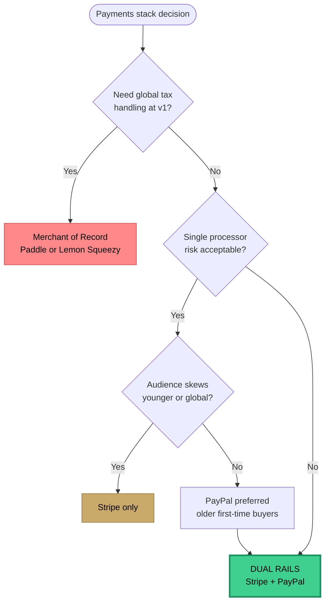

# 03 · Decision · Dual Payment Rails

## Context

At v1.2 (mid-March 2026), payments stack decision. Two revenue paths:

- **Subscriptions** — 4 tiers (Lucky Pro M/A, Lucky Max M/A)
- **Credit packs + impulse packages** — pay-per-reading

## Options considered

| Option | Pros | Cons |
|---|---|---|
| **Stripe only** | Best-in-class DX, subscription primitives, great dashboard | Some segments (older users, non-US) prefer PayPal; Stripe account reviews can freeze accounts |
| **PayPal only** | Broad trust, international reach, lower friction for first-time online buyers | Subscription API is worse, developer ergonomics are painful, reconciliation harder |
| **Stripe + PayPal (dual rails)** | Meet users where they already have a wallet; redundancy if one account gets held | 2× webhook surfaces, 2× reconciliation, 2× fraud models, more test matrix |
| **Lemon Squeezy / Paddle MoR** | Handles tax globally, simpler compliance | Higher fees, less control, less credible signal to enterprise buyers later |

### Scoring the options

| Dimension (weight) | Stripe only | PayPal only | **Dual rails** | MoR (Paddle) |
|---|:-:|:-:|:-:|:-:|
| User trust / conversion (×3) | 🟡 6 | 🟢 8 | 🟢 **9** | 🟡 7 |
| DX / velocity (×2) | 🟢 9 | 🔴 4 | 🟡 7 | 🟢 8 |
| Chargeback resilience (×3) | 🔴 4 | 🔴 4 | 🟢 **9** | 🟡 6 |
| Unit economics (×2) | 🟢 9 | 🟡 7 | 🟢 8 | 🔴 4 |
| Ops complexity (×1, inverted) | 🟢 9 | 🟡 7 | 🟡 6 | 🟢 9 |
| **Weighted score** | 65 | 55 | **78** | 64 |

### Decision flow

## Decision

**Dual rails — Stripe primary, PayPal secondary.** Highest weighted score. Strongest chargeback resilience, which was the gating concern.

## Rationale

1. **Trust surface.** Skeptical buyers — especially older demographics — have PayPal accounts and won't enter card details on new sites. PayPal at checkout measurably lowers friction.
2. **Processor redundancy.** High-emotion purchases carry elevated dispute risk. One processor can't kill the business. If Stripe freezes for review, PayPal keeps revenue flowing.
3. **Unit economics hold.** Fee differential (Stripe 2.9%+30¢ vs PayPal 3.49%+49¢) is small vs. the cost of a lost customer at checkout.

## Tradeoffs accepted

- **2× webhook surface.** Both endpoints need signature verification + idempotency. Covered in pre-launch checklist.
- **Reconciliation complexity.** Different provider IDs. Schema abstracts `provider_*` columns so app code doesn't branch on rail.
- **State normalization.** PayPal's subscription state machine is thinner than Stripe's. Both map into one internal state (`active | past_due | canceled | refunded | disputed`).

## Testing

Pre-launch (v1.4.1):

- Full test loop both rails: checkout → webhook → credits delta → refund → reversal
- Dispute simulation — test chargeback, verified `chargeback_cases` row + evidence-stamped email logged
- Subscription lifecycle: upgrade, downgrade, cancel → webhook → UI state

## Would change

Build `PaymentProvider` abstraction at v1.0 even with only Stripe implemented. Retrofitting at v2.0 cost ~1.5 days.

---

*Artifacts referenced:* `payment_consents` · `chargeback_cases` · `STRIPE_WEBHOOK_SECRET` · `PAYPAL_WEBHOOK_ID`. See [pre-launch checklist](./06-operating-rhythm.md#pre-launch-checklist).
