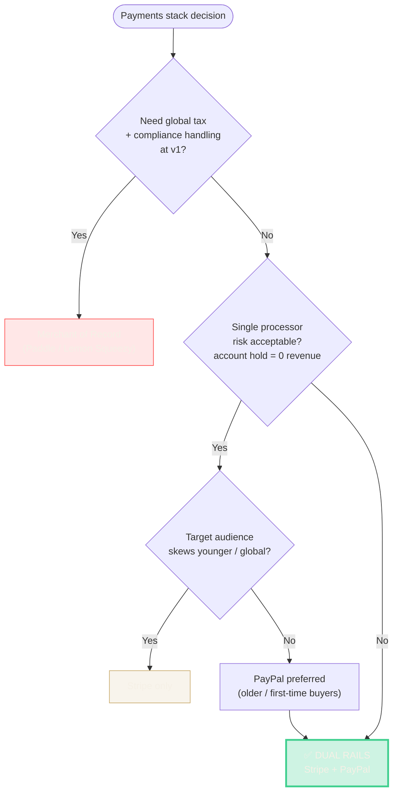

# 03 · Decision — Dual Payment Rails (Stripe + PayPal)

## Context

At v1.2 (mid-March 2026) I had to pick a payments stack. The product has two revenue paths:

- **Subscriptions** — 4 tiers (Lucky Pro Monthly/Annual, Lucky Max Monthly/Annual)
- **Credit packs + impulse packages** — pay-per-reading, pay-as-you-go

## Options considered

| Option | Pros | Cons |
|---|---|---|
| **Stripe only** | Best-in-class DX, subscription primitives, great dashboard | Some segments (older users, non-US) prefer PayPal; Stripe account reviews can freeze accounts |
| **PayPal only** | Broad trust, international reach, lower friction for first-time online buyers | Subscription API is worse, developer ergonomics are painful, reconciliation harder |
| **Stripe + PayPal (dual rails)** | Meet users where they already have a wallet; redundancy if one account gets held | 2× webhook surfaces, 2× reconciliation, 2× fraud models, more test matrix |
| **Lemon Squeezy / Paddle MoR** | Handles tax globally, simpler compliance | Higher fees, less control, less credible signal to enterprise buyers later |

### Scoring the options

| Dimension (weight) | Stripe only | PayPal only | **Dual rails** | MoR (Paddle) |
|---|:-:|:-:|:-:|:-:|
| User trust / conversion (×3) | 🟡 6 | 🟢 8 | 🟢 **9** | 🟡 7 |
| DX / velocity (×2) | 🟢 9 | 🔴 4 | 🟡 7 | 🟢 8 |
| Chargeback resilience (×3) | 🔴 4 | 🔴 4 | 🟢 **9** | 🟡 6 |
| Unit economics (×2) | 🟢 9 | 🟡 7 | 🟢 8 | 🔴 4 |
| Ops complexity (×1, inverted) | 🟢 9 | 🟡 7 | 🟡 6 | 🟢 9 |
| **Weighted score** | 65 | 55 | **78** | 64 |

### Decision flow

## Decision

**Ship dual rails — Stripe primary, PayPal secondary.** Highest weighted score, strongest chargeback resilience (which was the gating concern for a high-emotion consumer category).

## Rationale

1. **Trust surface.** Spiritual/wellness content attracts skeptical buyers — especially older demographics who have existing PayPal accounts but won't enter card details on a new site. Offering PayPal at checkout measurably lowers friction.
2. **Chargeback surface.** High-emotion purchases (spiritual readings) have elevated buyer's-remorse chargeback risk. Splitting rails means no single processor's risk model can kill the business. If Stripe puts the account under review, PayPal keeps revenue flowing and vice-versa.
3. **Unit economics still work.** Fee differential (Stripe ~2.9%+30¢ vs PayPal ~3.49%+49¢) is small relative to the cost of a lost customer at checkout.

## Trade-offs I accepted

- **2× webhook surface.** Both `/api/billing/webhook` endpoints need signature verification (`STRIPE_WEBHOOK_SECRET`, `PAYPAL_WEBHOOK_ID`) and idempotency. Documented in the pre-launch checklist.
- **Reconciliation complexity.** Both providers emit their own IDs (`session.id`, `subscription.id`, `order.id`, `capture.id`). Schema had to abstract `provider_*` columns so the rest of the app doesn't branch on rail.
- **Subscription lifecycle parity.** PayPal's subscription state machine is less rich than Stripe's. I normalize both into a single internal state (`active | past_due | canceled | refunded | disputed`) for app-level logic.

## How I tested it

Before go-live (v1.4.1):

- Full test-mode loop on both rails: checkout → webhook → credits delta → refund → webhook → credits reversal
- Chargeback simulation — manually issued a test dispute, confirmed `chargeback_cases` row was created and email was logged with `chargeTimestamp` + policy URL
- Subscription lifecycle: upgrade, downgrade, cancel in portal → webhook downgrade → confirm UI state

## What I'd do differently

- Built rail-abstraction earlier. I put Stripe in at v1.2 and added PayPal at v2.0, which meant retrofitting some payment-flow code. Cleaner would've been to define the `PaymentProvider` interface at v1.0 and wire both in from day one.

---

**Referenced artifacts:** `payment_consents`, `chargeback_cases`, `STRIPE_WEBHOOK_SECRET`, `PAYPAL_WEBHOOK_ID` (see [pre-launch checklist](./06-operating-rhythm.md#pre-launch-checklist)).
