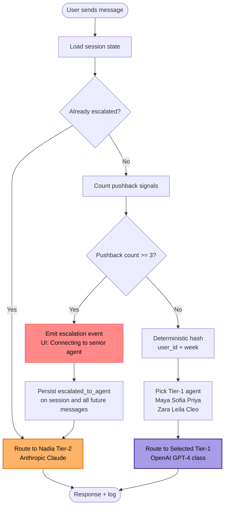
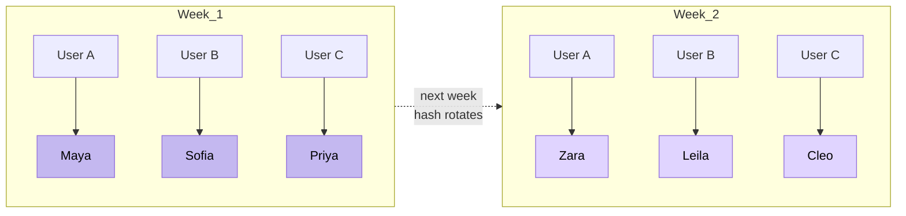

# 04 · Decision — Tiered AI Support Agents

## Context

At v2.0.7, I shipped a multi-tier AI support system to handle inbound user questions without hiring a support rep. Requirements:

- Answer common questions (billing, subscription, reading interpretation, account issues) fast and accurately
- Escalate to a more capable model when the Tier-1 agent clearly isn't working
- Never *sound* like the same bot twice — users who hit support multiple times shouldn't feel "here's that same AI again"
- Never confirm or deny being a bot (it's a product design decision — warm support persona, not deceptive)

## The design

### Tier-1: six rotating agents

Six distinct agent personas (Maya, Sofia, Priya, Zara, Leila, Cleo), each with:
- A unique voice and persona card
- Same underlying model (OpenAI GPT-4-class), different system prompts
- Weekly rotation *per user*, via a **deterministic hash** of `(user_id, week_number)` → one of six agents

The deterministic-hash approach means:
- Same user gets the same agent all week (consistency within a session)
- Different users get different agents at the same time (load/affinity distribution)
- Week rolls over → new agent for the next week (freshness)

### Tier-2: escalation

One escalation agent, **Nadia**, runs on Anthropic Claude (different provider for redundancy + reasoning strength). Triggered when:

- **3 pushback signals** from the user in the same session (negative sentiment, "this isn't helpful", repeated clarifications)

Escalation is **in-place** — same chat thread, soft UI transition (`"Connecting you to a senior agent..."` indicator, 4.5-second handoff). Users don't lose context.

### Message routing flow

### Weekly rotation across users

Same user = same agent all week (session continuity). New week = freshness. Across users at any moment = load distribution.

## Why this structure (vs alternatives)

| Alternative | Why I didn't pick it |
|---|---|
| **Single bot, always** | Feels samey; no escalation recourse; no "senior agent" trust signal |
| **Random agent per session** | Breaks continuity mid-session |
| **Human escalation only** | Not sustainable solo; would've blocked launch |
| **Pure LLM routing (agent swarm)** | Over-engineered for v1 volume; hard to debug |

The weekly-rotation + triggered-escalation pattern is **deterministic, debuggable, and feels humane** — three things "agentic" systems typically aren't.

## Bugs I hit and fixed

**The escalation persistence bug (v2.0.7).** Escalated sessions were reverting to Tier-1 after the next message — the `escalated_to_agent` column was being reset to null on every message write. Root cause: a stale default value in the message-insert path.

Fix shipped same day; backfilled affected sessions. Documented in the [CHANGELOG](https://github.com/omkarjaliparthi/insights-by-omkar) under v2.0.7. A TPM instinct: **this would've been caught in staging if I'd had a 2-message escalation smoke test**. I added that to the pre-launch checklist.

## Design decisions with governance in mind

- **"Are you a bot?" handling** — the agent sidesteps the question warmly without confirming or denying. This is deliberate and legally reviewed from my LLB training: we don't claim human status (that would be deceptive), but we don't volunteer a bot disclosure that breaks immersion. Terms of Service state AI is used.
- **Chat transcripts logged** in `chat_messages` with full context — important for dispute defense if a user later claims "the bot told me X"
- **Event messages** (`"Maya joined the chat"`, `"Connecting you to a senior agent..."`) are UI-only — filtered out of the OpenAI context so they don't pollute the model's reasoning

## What this demonstrates for a PM/TPM audience

- **Product judgment** — six rotating personas is a real design call, not a coin-flip
- **System thinking** — deterministic hashing for distribution + consistency
- **Operational discipline** — shipped the bug fix within the same release cycle + added a preventive test
- **Governance awareness** — bot-disclosure, transcript logging, ToS alignment
