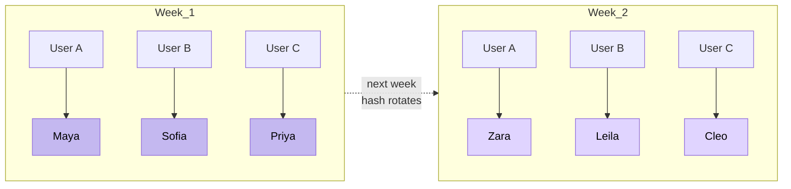

# 04 · Decision · Tiered AI Support Agents

## Context

v2.0.7 shipped a multi-tier AI support system — no hired rep. Requirements:

- Fast, accurate answers on billing, subscription, reading interpretation, account
- Escalate to a stronger model when Tier-1 stalls
- Never sound like the same bot twice across sessions
- Never confirm or deny being a bot — warm persona, not deceptive

## Design

### Tier-1 — six rotating agents

Six personas (Maya, Sofia, Priya, Zara, Leila, Cleo). Each has:
- Unique voice and persona card
- Same underlying model (OpenAI GPT-4 class), different system prompts
- **Weekly rotation per user** via deterministic hash of `(user_id, week_number)`

Why deterministic hash:
- Same user, same agent all week → session continuity
- Different users, different agents concurrently → load distribution
- Week rolls → new agent → freshness

### Tier-2 — escalation

**Nadia** on Anthropic Claude (different provider = redundancy + reasoning strength). Triggered after **3 pushback signals** in a session (negative sentiment, "this isn't helpful", repeated clarifications).

In-place handoff: same thread, soft UI transition (`"Connecting to a senior agent..."`, 4.5s). Context preserved.

### Message routing flow

### Weekly rotation across users

## Why this pattern

| Alternative | Rejected because |
|---|---|
| Single bot, always | Samey. No escalation recourse. No senior-agent trust signal. |
| Random agent per session | Breaks continuity mid-session. |
| Human escalation only | Not sustainable solo. Would have blocked launch. |
| Pure LLM routing / agent swarm | Over-engineered for v1 volume. Hard to debug. |

Weekly rotation + triggered escalation is **deterministic, debuggable, humane** — three things agentic systems typically aren't.

## Bug & fix · v2.0.7

Escalated sessions reverted to Tier-1 on the next message. Root cause: stale `escalated_to_agent` default on message insert.

Same-day fix. Affected sessions backfilled. CHANGELOG v2.0.7.

**Preventive:** added a 2-message escalation smoke test to the pre-launch checklist. Would have caught it.

## Governance built-in

- **"Are you a bot?"** — sidestepped warmly. We don't claim human status (deceptive); we don't volunteer disclosure (breaks immersion). ToS discloses AI use. LLB-reviewed.
- **Transcripts persist** in `chat_messages` — dispute defense if a user claims "the bot told me X"
- **UI event messages** (`Maya joined the chat`, `Connecting to senior agent...`) are filtered out of the OpenAI context — no reasoning pollution

## What this evidences

- **Product judgment** — six rotating personas is a real design call, not a coin-flip
- **Systems thinking** — deterministic hashing for distribution + consistency
- **Operational discipline** — same-release fix + preventive test
- **Governance awareness** — bot disclosure, transcript logging, ToS alignment
