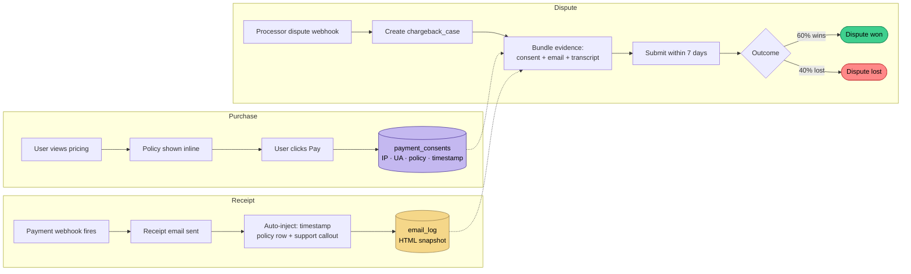

# 05 · Decision — Chargeback Defense Infrastructure

## Context

High-emotion consumer purchases (spiritual readings, subscription impulse buys) have elevated **chargeback rates** — 0.5–1.5% vs ~0.1% for normal e-commerce. Chargebacks are existential for a small business: exceed a processor's threshold (Stripe: 0.75%) and your merchant account is paused or terminated.

I knew this going in. My LLB (law) training — contracts, consumer protection, evidentiary burden of proof — shaped the design from v1.0, not as a retrofit.

## The design

### Data model (from `supabase/migrations/...support_agent_chargeback.sql`)

Three tables layer the defense:

| Table | Purpose |
|---|---|
| `payment_consents` | Proof of consent: which pricing page did the user see, what did they accept, when, from what IP/user-agent |
| `chargeback_cases` | Case tracking: dispute ID, status, evidence bundle, resolution |
| `email_log` | Every transactional email archived — sender, recipient, template, timestamp, HTML snapshot — as evidence trail |

### Payment receipts are evidence artifacts

Every Stripe/PayPal payment-receipt email auto-injects:

1. **Amber "Questions about this charge?" callout** with support email + policy link — so the user has an obvious non-chargeback escape path
2. **"Charged on [date/time PDT]"** — timestamped proof of authorization
3. **Policy row** — for credits: *"Credits are non-refundable once added."* For appointments: *"Full refund >24 hrs · Non-refundable within 24 hrs."*
4. **Footer legal line** — *"By completing this purchase you agreed to our Refund & Cancellation Policy"* with link to `/legal/refunds`

This isn't legal theater. When a processor dispute opens, the merchant has ~7 days to submit evidence. Having the receipt archived, timestamped, and policy-stamped **at the moment of purchase** means I can win disputes I would otherwise lose.

### Refund policy: per-product granularity

Two tables — `credit_package_refund_policies` and `appointment_type_refund_policies` — store per-product refund rules. The policy is **referenced, not hard-coded**, so:

- Adjusting a policy doesn't require a code deploy
- Admin panel lets me set cancellation windows, refund percentages, and fees per product
- The same policy rendered to the user at checkout is what's enforced by the webhook handler

### Evidence chain — from purchase to dispute win

The key insight: **evidence must exist at the moment of purchase**, not assembled after a dispute opens. Every link in this chain is built to be an evidentiary artifact.

## Why this matters for a PM/TPM audience

Most consumer AI founders treat chargeback defense as an *operational* problem — something you deal with when the first dispute comes in. By then, it's too late: the evidence you needed didn't exist.

Treating it as a **product problem** means:

- Refund terms are visible at checkout, in receipts, and in-product (no "hidden terms" argument)
- Every consent is logged with context (IP, UA, timestamp, policy version)
- Every email becomes an evidentiary artifact
- Support agents have access to the full purchase + communication timeline when a user complains

This is the kind of cross-functional thinking — product + engineering + legal + finance — that senior PM/TPM roles hire for. The law degree helped me see the shape of it; the engineering let me actually build it.

## What this cost in engineering time

- `payment_consents` + `chargeback_cases` + `email_log` migrations: ~3 hours
- Email template rewrite (8 templates, injected evidence rows): ~1 day
- Refund-policy table refactor: ~half a day

Total: **~2 days of eng work**, protecting potentially the entire business.

## What I'd do differently

- **Instrument a "dispute dashboard" earlier.** Right now, the admin panel has chargeback cases visible, but I'd want per-product dispute rates, refund-rate trendlines, and alerting when a threshold is crossed. Next on the roadmap.
- **Pre-dispute "save" flow.** When the amber callout gets clicked, route the user to a support conversation *before* they file a bank dispute. Early data from other SaaS products says this converts 30%+ of would-be chargebacks into refunds (cheaper) or resolutions (free).
