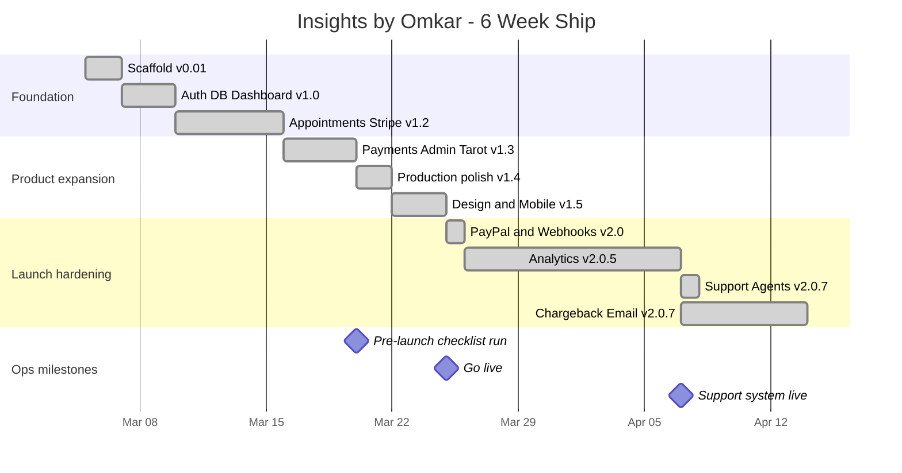

# 06 · Operating Rhythm

How this project actually got run — shipped in 6 weeks with TPM discipline, not vibes.

---

## Versioned release discipline

20+ versioned releases between 2026-03-05 and 2026-04-14. Each release is:

1. **Scoped** — a short list of user-facing changes, never a grab-bag
2. **Tested** on branch before merge
3. **Documented** in `CHANGELOG.md` under the exact version tag
4. **Tagged** in git
5. **Announced** (internally to me, externally via changelog page at `/changelog`)

### Version cadence

- `v0.01` — initial scaffold (2026-03-05)
- `v1.0` — auth, DB, dashboard (2026-03-07)
- `v1.2` — 1-on-1 appointments + Stripe (2026-03-10)
- `v1.3` — payment flow + admin + expanded Tarot AI (2026-03-16)
- `v1.4` — production-ready polish (2026-03-20)
- `v1.5` — design overhaul + mobile responsiveness (2026-03-22 → 03-24)
- `v2.0` — PayPal added, webhook fixes (2026-03-25)
- `v2.0.1–2.0.7` — analytics, support agent system, chargeback defense, email rewrite (2026-03-26 → 04-14)

**Each version is a TPM artifact.** You can point at any one and trace the scope, the risk, the rollback plan.

### 6-week release timeline

---

## Pre-launch checklist (13 sections)

Before v1.4.1 shipped, I ran a 13-section readiness checklist — the kind every FAANG launch program has, scaled down for a solo founder:

1. **Environment variables** across production, preview, development (40+ vars)
2. **Stripe dashboard** — webhooks, prices, customer portal
3. **PayPal dashboard** — webhooks, live mode
4. **Supabase** — migrations, RLS, service-key scope, backups
5. **Domain + DNS** — apex, www, SSL, MX
6. **Resend email** — SPF, DKIM, DMARC, inbound routing
7. **Vercel Cron** — 5 jobs enabled, `CRON_SECRET` set
8. **Analytics + Search** — GA4, Search Console, sitemap, Bing, IndexNow
9. **Monitoring** — Sentry, Vercel Speed Insights, uptime pings
10. **Legal + content** — Privacy, Terms, Refund, cookie consent
11. **Assets** — favicon, OG images, fallbacks
12. **Pre-flight smoke tests** on production URL (signup → pay → reading → refund → cancel)
13. **Day-of-launch** — live keys flip, robots.txt, announcement

The full checklist lives in the private repo as `PRE_LAUNCH_CHECKLIST.md`. An anonymized template will land in the [TPM × PM Portfolio](https://github.com/omkarjaliparthi/tpm-portfolio).

---

## Cron schedule as an ops artifact

See [02-architecture.md § Cron topology](./02-architecture.md#cron-topology) for the 5 jobs. Each is:

- **Signed** — `CRON_SECRET` header check
- **Idempotent** — safe to retry
- **Observable** — errors hit Sentry, success/duration hits `observability` tables

A cron job that fails silently is worse than no cron job. Each one has a watchdog.

---

## Incident response

I treat every production issue as a postmortem candidate. At this scale there's no formal severity scale — instead I use a two-question filter:

1. Is a user *currently* unable to do something they paid for?
2. Is there a revenue or compliance exposure?

If yes to either → **stop what I'm doing, fix, post-mortem**. If no → queue, ship in next release.

**Two examples from the build:**

- **Stripe webhook `.catch()` type error** (v2.0.7) — was blocking Vercel builds. No user impact, but blocking my ability to ship. Fixed in the same release cycle.
- **Support agent escalation reverting to Tier-1** (v2.0.7) — user-facing bug, fixed same day. Added a 2-message escalation smoke test to the checklist to prevent recurrence.

---

## Operating tooling

- **Jira-equivalent for solo dev:** a flat changelog + a running decisions doc. No PM overhead for a team of 1.
- **AI-native context:** `update-ai-context.sh` + `repomix-output.xml` — I keep a distilled codebase context up-to-date so AI coding tools can reason over the full system. This is a TPM practice translated for the AI era: **keep the "program state" compressed and queryable**.

---

## What this rhythm produces

- 20+ shippable releases in 6 weeks
- Zero accidental production outages
- Clean audit trail for every user-visible change
- Compliance-ready posture (RLS, DMARC, consent, policy-stamped receipts) from day 1

**The rhythm is the moat.** Anyone can build a feature. Fewer people ship 20 features in 6 weeks without breaking production.
