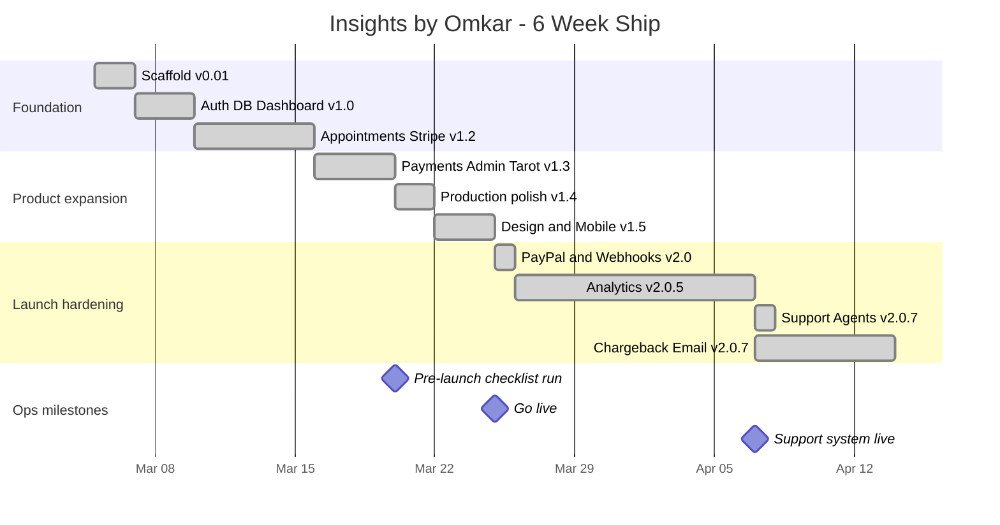

# 06 · Operating Rhythm

Shipped in 6 weeks with TPM discipline, not vibes.

---

## Versioned release discipline

20+ releases between 2026-03-05 and 2026-04-14. Each is:

1. **Scoped** — short list of user-facing changes, never a grab-bag
2. **Tested** on branch before merge
3. **Documented** in `CHANGELOG.md` under the version tag
4. **Tagged** in git
5. **Announced** — internally + via `/changelog` page

### Version cadence

- `v0.01` — initial scaffold (2026-03-05)
- `v1.0` — auth, DB, dashboard (2026-03-07)
- `v1.2` — 1-on-1 appointments + Stripe (2026-03-10)
- `v1.3` — payment flow + admin + expanded Tarot AI (2026-03-16)
- `v1.4` — production-ready polish (2026-03-20)
- `v1.5` — design overhaul + mobile responsiveness (2026-03-22 → 03-24)
- `v2.0` — PayPal added, webhook fixes (2026-03-25)
- `v2.0.1–2.0.7` — analytics, support agent system, chargeback defense, email rewrite (2026-03-26 → 04-14)

**Each version is a TPM artifact.** You can point at any one and trace the scope, the risk, the rollback plan.

### 6-week release timeline

---

## Pre-launch checklist · 13 sections

Before v1.4.1 shipped — the same structure every FAANG launch program uses, sized for a solo founder:

1. **Env vars** · 40+ across prod / preview / dev
2. **Stripe** · webhooks, prices, customer portal
3. **PayPal** · webhooks, live mode
4. **Supabase** · migrations, RLS, service-key scope, backups
5. **DNS** · apex, www, SSL, MX
6. **Resend** · SPF, DKIM, DMARC, inbound routing
7. **Vercel Crons** · 5 jobs + `CRON_SECRET`
8. **Analytics + Search** · GA4, GSC, sitemap, Bing, IndexNow
9. **Monitoring** · Sentry, Speed Insights, uptime
10. **Legal** · Privacy, Terms, Refund, cookie consent
11. **Assets** · favicon, OG images, fallbacks
12. **Smoke tests on prod** · signup → pay → reading → refund → cancel
13. **Day-of-launch** · key flip, robots.txt, announcement

Full checklist lives in the private repo as `PRE_LAUNCH_CHECKLIST.md`. Anonymized template in the [TPM × PM Portfolio](https://github.com/omkarjaliparthi/tpm-portfolio).

---

## Cron schedule as ops artifact

See [§ Cron topology](./02-architecture.md#cron-topology) for the 5 jobs. Each is:

- **Signed** — `CRON_SECRET` header check
- **Idempotent** — safe to retry
- **Observable** — errors to Sentry, success/duration to `observability` tables

A cron that fails silently is worse than no cron. Each has a watchdog.

---

## Incident response

Every production issue is a postmortem candidate. No formal severity scale at this scale. Two-question filter:

1. Is a user *currently* unable to do something they paid for?
2. Is there revenue or compliance exposure?

Either → stop, fix, post-mortem. Neither → queue for next release.

**Examples:**

- **Stripe webhook `.catch()` type error (v2.0.7)** — blocked Vercel builds. Zero user impact, blocked my ability to ship. Fixed same cycle.
- **Support agent escalation reverting to Tier-1 (v2.0.7)** — user-facing, fixed same day. Added 2-message escalation smoke test to the checklist.

---

## Operating tooling

- **Jira equivalent for solo** — a flat changelog + running decisions doc. Zero PM overhead for team of 1.
- **AI-native context** — `update-ai-context.sh` + `repomix-output.xml` keep a distilled codebase context up-to-date for AI coding tools. **Keep program state compressed and queryable.**

---

## What this rhythm produces

- 20+ shippable releases in 6 weeks
- Zero accidental production outages
- Clean audit trail per user-visible change
- Compliance-ready posture from day 1 — RLS, DMARC, consent, policy-stamped receipts

**The rhythm is the moat.** Anyone can build a feature. Few ship 20 features in 6 weeks without breaking production.
