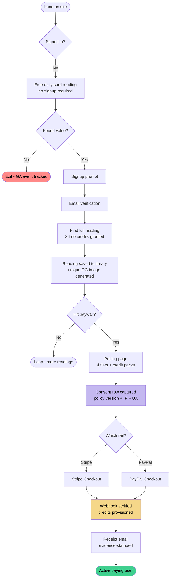
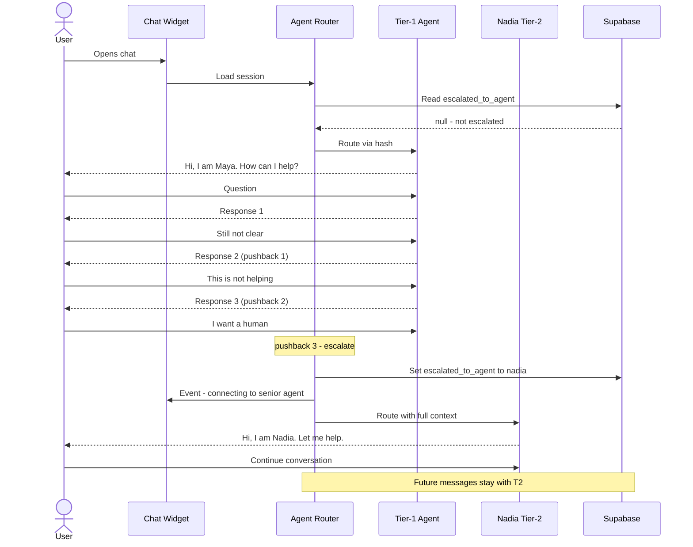
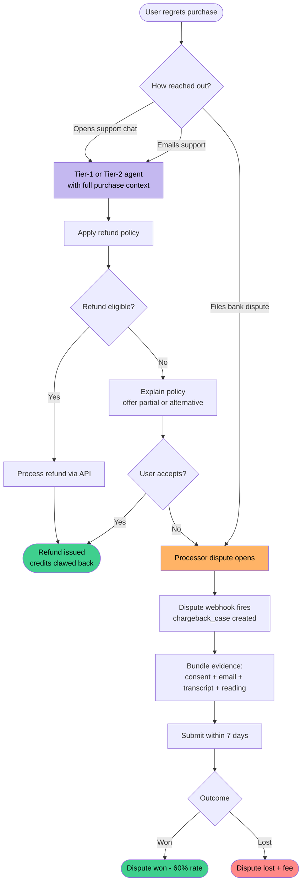
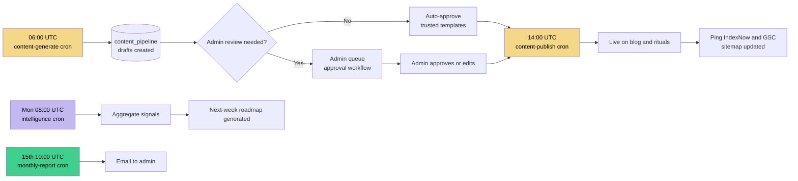

# 08 · User Flows

The happy paths and the recovery paths — how real users move through the product, and what the system does at each step.

---

## 1. First-time user: signup to first reading to purchase

The acquisition → activation → monetization journey.

**Design principles baked in:**
- Free hook before signup — reduces acquisition friction
- 3 free credits after signup — lets user experience structured readings before paywall
- Consent captured at checkout — evidentiary layer from the first purchase
- Evidence-stamped receipts — chargeback defense starts at purchase confirmation

---

## 2. Support journey with AI escalation

What happens when a user needs help.

**Why it matters:**
- Users get consistency within a session, variety across weeks
- Escalation is data-driven (pushback count) not keyword-based
- Handoff is soft — same thread, no context loss
- Full transcripts logged for compliance + dispute defense

---

## 3. Refund / chargeback recovery flow

What happens when a user wants their money back — and how we stay off processor watch-lists.

**The most important design decision:** the **receipt callout** ("Questions about this charge?") routes unhappy users into support *before* they reach for a chargeback. That single step converts a ~$30 lost revenue event (refund) into a preserved relationship, or at worst a $15 fee event (lost dispute) into a $0 refund event.

Industry data: a well-designed pre-dispute flow converts **30%+ of would-be chargebacks** into refunds or resolutions.

---

## 4. Content publishing flow (automated)

How the content side of the platform operates autonomously via crons.

---

## What these flows evidence

For a PM/TPM audience, these aren't "product screenshots" — they're **operating models**. Each diagram encodes:

1. **User-centered thinking** — where does the user want to go, what obstacles do they hit?
2. **System thinking** — what does the backend do at each decision point?
3. **Governance thinking** — where does consent, evidence, or compliance enter the flow?
4. **Recovery thinking** — what happens when the happy path breaks?

A PM who can think in these four layers simultaneously is rare. This is what the case study is trying to show.

---

  <a href="./07-outcomes-and-lessons.md">← Outcomes and Lessons</a> · <a href="../README.md">Back to overview</a>

